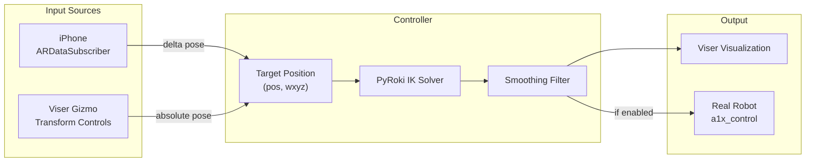

# Phone Control Integration Design

## Problem
Users want to control the real A1X robot using iPhone pose data while retaining the ability to manually adjust targets via Viser's interactive controls.

## Architecture

### Data Flow


### Mode Behavior

| Mode | Phone Enable | Gizmo Behavior | Target Source |
|------|--------------|----------------|---------------|
| Manual (default) | ❌ | Interactive | Gizmo position |
| Phone | ✅ | Read-only indicator | Phone delta + init pose |

When phone control is enabled:
1. Capture current gizmo position as `init_target_pos` / `init_target_rot`
2. Wait for first phone frame → set as origin (`phone_base_*`)
3. Each frame: `target = init + (phone_current - phone_base)`
4. Update gizmo visually to show computed target (read-only)

### PhoneListener Class

Reuse from `02_phone_ik.py` with minor modifications:
- Add `is_connected` property for UI status
- Add `reset_origin()` method for re-zeroing
- Make IP configurable at construction

```python
class PhoneListener:
    def __init__(self, ip: str):
        self.ip = ip
        self.latest_pose = None  # [x, y, z, qx, qy, qz, qw]
        self.lock = threading.Lock()
        self.running = True
        self.connected = False
        self.thread = threading.Thread(target=self._run, daemon=True)
        self.thread.start()
    
    def reset_origin(self) -> None:
        """Called externally to re-zero the phone origin."""
        # Handled by control loop, just need to signal
        pass
    
    def get_pose(self) -> Optional[np.ndarray]:
        with self.lock:
            return self.latest_pose.copy() if self.latest_pose is not None else None
    
    def stop(self) -> None:
        self.running = False
```

### UI Additions

Within a new folder `"Phone Control"`:
- `phone_ip`: Text input, default `"192.168.31.196"`
- `enable_phone`: Checkbox, default `False`
- `reset_origin_btn`: Button, resets `phone_base_*` to `None`
- `phone_status`: Text display, shows connection state

### Control Loop Integration

```python
# Existing loop structure (simplified):
while True:
    # NEW: Check phone mode
    if enable_phone.value and phone_listener.connected:
        phone_pose = phone_listener.get_pose()
        if phone_pose is not None:
            # Compute delta and update target
            target_position, target_wxyz = compute_phone_target(
                phone_pose, phone_base_pos, phone_base_rot_inv,
                init_target_pos, init_target_rot
            )
            # Update gizmo visually (becomes indicator)
            ik_target.position = tuple(target_position)
            ik_target.wxyz = tuple(target_wxyz)
    else:
        # EXISTING: Read from gizmo
        target_position = np.array(ik_target.position)
        target_wxyz = np.array(ik_target.wxyz)
    
    # EXISTING: IK solve, smooth, visualize, send to robot
    ...
```

## Concurrency Considerations

- `PhoneListener` runs in daemon thread, updates `latest_pose` atomically
- Main loop reads `latest_pose` via `get_pose()` with lock
- No blocking operations in main loop
- Phone disconnection detected via `connected` flag
